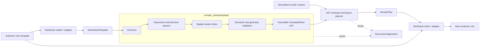

# Architecture explained

This document explains how the current Excel template interpreter works as one system. It is aimed at maintainers and platform engineers. For author-facing syntax, see [`directives.md`](directives.md). For the normative language design, see [`../SPEC.md`](../SPEC.md).

## The central idea

The engine is a spatial interpreter, not a text substitution utility.

A normal template engine reads one stream of text. This engine reads individual cells and also considers their worksheet coordinates. An opening directive in the top-left cell and its closing directive in the bottom-right cell define an exact rectangle. That rectangle becomes an AST node whose contents can be repeated, selected, measured, and placed.

The architecture deliberately separates three questions:

1. What does the template mean?
2. Where will every rendered cell go?
3. How is that plan applied to an `.xlsx` package?

The compiler answers the first question, the pure renderer and layout planner answer the second,
and the XLSX adapter answers the third. All three layers are now executable. The adapter remains
strictly downstream of the plan and rejects workbook features it cannot transform safely.

## End-to-end flow



The important dependency direction is left to right. `openpyxl` belongs at the reader/writer edges. The lexer, parsers, AST, compiler, evaluator, and layout planner do not import it.

## The data representations

Each stage produces a representation suited to one job. Later stages consume those representations instead of re-reading template strings.

### Worksheet model

[`model.py`](../src/excel_template_writer/model.py) contains the adapter-neutral worksheet model:

- `Coordinate` represents a one-based row and column and can convert to and from A1 notation.
- `Rectangle` represents an inclusive source region and provides containment, disjointness, width, height, and area operations.
- `WorksheetTemplate` is an immutable mapping of coordinates to raw cell values.

The pure model carries values, material blank cells, geometry, and merged ranges. The XLSX-owned
snapshot model in [`xlsx/model.py`](../src/excel_template_writer/xlsx/model.py) additionally carries
detached presentation data, row and column dimensions, formulas, hyperlinks, comments, and feature
flags. These additions do not introduce `openpyxl` into the language core.

### Tokens and source spans

[`syntax.py`](../src/excel_template_writer/syntax.py) lexes each string cell independently. It recognizes:

- `TextToken` for literal cell text;
- `OutputToken` for `{{ expression }}`;
- `DirectiveToken` for ``.

Every token carries a `SourceSpan`: worksheet name, cell address, and character offsets. This is why a syntax error can identify a cell such as `Report!B4` rather than reporting only a generic parser failure.

Non-string cells bypass the text lexer and become literal typed cell parts.

### Expression AST

[`expressions.py`](../src/excel_template_writer/expressions.py) owns a small expression lexer, parser, AST, and evaluator. It produces nodes such as:

- `LiteralExpression`;
- `NameExpression`;
- `AttributeExpression`;
- `IndexExpression`;
- `UnaryExpression`;
- `BinaryExpression`;
- `FilterExpression`.

The engine does not call Python `eval`. Property lookup operates on mappings, private names beginning with `_` are forbidden, and arbitrary function or method calls are not in the grammar. This is both a security boundary and a language-stability boundary.

### Directive markers

[`directives.py`](../src/excel_template_writer/directives.py) parses structural tags into typed marker objects:

- `ForDirective` and `EndForDirective`;
- `IfDirective`, `ElseDirective`, and `EndIfDirective`.

At this point these objects are markers, not complete spatial blocks. A textual parser knows that a cell contains `endfor`; it cannot decide which `for` owns it until worksheet coordinates are considered.

### Worksheet AST

[`ast.py`](../src/excel_template_writer/ast.py) contains the compiled spatial AST:

- `CellNode` holds the typed parts remaining after directives are removed;
- `ForNode` owns a rectangle, loop variable, collection expression, shift policy, and nested regions;
- `IfNode` owns an overall rectangle, true and optional false rectangles, condition, inherited shift policy, and nested regions;
- `CompiledSheet` owns immutable cells and the top-level region tree.

A representative tree looks like this:

```text
CompiledSheet
├── static CellNodes
└── ForNode: groups, rectangle A4:D6
    ├── CellNodes evaluated in scope {group}
    └── ForNode: group.items, rectangle A5:B5
        └── CellNodes evaluated in scope {group, item}
```

The hierarchy is important. A nested loop is evaluated inside its parent's lexical scope and is measured before the parent is placed.

### Render plan

[`render.py`](../src/excel_template_writer/render.py) produces a `RenderPlan`, which contains:

- the worksheet name;
- final height and width;
- an ordered collection of `PlannedCell` objects;
- explicit `PlannedRow` source-to-destination mappings;
- explicit `PlannedMerge` source-to-destination mappings.

Each `PlannedCell` records:

- its destination coordinate;
- its evaluated value;
- its original source coordinate;
- its loop instance path.

The source-to-destination mapping lets a workbook writer copy presentation properties from the correct template cell without parsing the template again. The instance path distinguishes copies made by nested repeats.

## What compilation does

`compile_sheet()` in [`compiler.py`](../src/excel_template_writer/compiler.py) is a multi-pass compiler even though its public API is one function.

### 1. Lex and parse every cell

Every populated source cell becomes a `CellNode`. Literal text is retained, output expressions become expression AST nodes, and directive text becomes structural markers. Directive tags themselves are not retained as output content.

Compilation stops with diagnostics if any cell has an unterminated tag, invalid expression, unknown directive, or invalid marker position.

### 2. Pair spatial markers

The compiler gathers all opening and closing markers. A closing marker is a candidate only when:

- its type matches the opener;
- it is at or below the opener;
- it is at or to the right of the opener;
- when both tags share a cell, the opener occurs first.

The compiler explores the possible pairings and keeps only interpretations whose rectangles are nested or disjoint. Partial overlap is illegal. Exactly one complete interpretation must remain; zero interpretations means invalid geometry, while more than one means ambiguity.

There are intentionally no required block IDs. Geometry is the identity of a block.

### 3. Associate conditional branches

An `else` marker is associated with the nearest compatible containing `if` rectangle. It must be at the right edge of that rectangle and above `endif`.

The true branch runs from the `if` cell to the `else` cell. The false branch begins on the following row, at the same left column, and ends at `endif`. This gives vertically stacked, equal-width branches.

### 4. Build the region tree

The compiler selects the smallest strict containing rectangle as each node's parent. Nodes without a parent become top-level children of `CompiledSheet`.

This pass also rejects:

- equal or partially overlapping regions;
- a nested block that crosses an `if` branch boundary;
- side-by-side siblings with overlapping source rows when either claims whole-row shifting.

### 5. Freeze the result

The final `CompiledSheet` is immutable. It can be rendered repeatedly with different data without reparsing the template. Compilation does not mutate a workbook and does not require render data.

## What rendering and layout do

`render_sheet(compiled, context)` combines evaluation and pure layout planning. It does not write an XLSX file.

### Cell evaluation

Each `ExpressionPart` is evaluated against the current lexical scope.

- A cell containing one expression preserves its native value type.
- A cell mixing literal text and expressions becomes text.
- A collection used directly as a scalar is an error.
- A missing value is an error unless handled by `default` or by the special empty-repeat placeholder behavior.

### Recursive block measurement

The internal `render_area()` operation works in coordinates local to the current rectangle:

1. Render ordinary cells that are not owned by a direct child region.
2. Recursively render each direct child.
3. Compare the child's rendered height with its source height.
4. Shift affected cells by the height difference.
5. Place the completed child block into its allocated location.

Because nested children finish first, a parent repeat knows the actual height of each rendered instance before stacking the instances.

### Repeat evaluation

For a `ForNode`, the renderer evaluates the collection expression. For each item it:

1. creates a child scope containing the loop variable;
2. renders the complete source rectangle in that scope;
3. includes any nested blocks;
4. stacks the resulting block below the preceding instance.

Input order is preserved. Sorting, grouping, joining business records, and keyed reconciliation belong before rendering.

For an empty collection, the body is rendered once without binding the loop variable. Expressions rooted at that absent variable become blank, while static content remains. This preserves one formatted placeholder instance.

### Conditional evaluation

For an `IfNode`, the condition selects the true or false rectangle. Only that rectangle is rendered. If a false condition has no `else`, the node produces a zero-height block. The containing shift policy closes the removed space.

Conditions have no author-facing `shift` option. At top level they shift rows. Inside a `shift="cells"` loop they inherit that lane isolation.

### Row shifting versus cell shifting

When a child grows or shrinks, its height difference is applied in one of two ways:

- `shift="rows"` moves every cell below the block;
- `shift="cells"` moves only cells below the block in columns intersecting the block.

The planner checks the destination grid for collisions. It returns diagnostics rather than silently overwriting an earlier allocation.

## A complete example

Suppose cells `A4:D4` contain:

```text
A4: {{ line.description }}
B4: {{ line.quantity }}
C4: {{ line.unit_price }}
D4: {{ line.total }}
```

and the context is:

```python
{
    "lines": [
        {"description": "Consulting", "quantity": 2, "unit_price": 100, "total": 200},
        {"description": "Support", "quantity": 1, "unit_price": 50, "total": 50},
    ]
}
```

The stages are:

1. The cell lexer splits `A4` into a `ForDirective` token and an output token.
2. The expression parser turns `lines` and `line.description` into expression ASTs.
3. The spatial linker pairs `A4` with the `endfor` in `D4`, producing rectangle `A4:D4`.
4. The compiler builds a `ForNode(variable="line", shift="rows")`.
5. The renderer evaluates `lines`, creates two item scopes, and renders the four-cell body twice.
6. The layout planner allocates the first instance to row 4 and the second to row 5. Static content originally below row 4 moves down one row.
7. The render plan records destination values and their source cells.
8. A workbook writer can copy the style of template `C4` to both rendered price cells and write their numeric values.

At no point does the engine perform global string replacement or discover a block by looking for blank cells.

## Diagnostics and atomicity

[`diagnostics.py`](../src/excel_template_writer/diagnostics.py) defines stable codes and source locations. Both compilation and rendering return result objects:

```python
compilation = compile_sheet(template)
if compilation.diagnostics:
    # Present all compile diagnostics to the caller.
    ...

compiled = compilation.require()  # Optional exception-based style.
rendering = render_sheet(compiled, context)
plan = rendering.require()
```

Compilation produces no AST on error. Rendering produces no plan on error. A production workbook writer must be invoked only after a complete plan exists, so invalid templates cannot leave a partially rendered workbook presented as success.

Current diagnostics cover lexical errors, invalid directives and expressions, unmatched or ambiguous markers, invalid geometry, partial overlap, missing data, scalar/collection type mistakes, row-shift conflicts, and destination collisions.

## The XLSX boundary

The production workbook path is:

```text
openpyxl workbook
    → immutable workbook model
    → compile and validate
    → render plan
    → mutate a separate workbook copy
    → save
    → reopen and verify
```

The writer must consume the plan. It must not parse directives, evaluate expressions, or decide where rows belong. Its responsibilities are mechanical workbook operations such as writing typed values and applying planned transformations to styles, dimensions, merges, and supported metadata.

The adapter is implemented in [`xlsx/`](../src/excel_template_writer/xlsx). It snapshots every
material cell, including styled blanks; copies direct cell formatting from each planned source;
applies planned row properties and merges; writes atomically to a different path; and reloads the
serialized package. [`../scratch/demo.py`](../scratch/demo.py) now exercises this production path.

## Current boundaries

The executable system currently supports vertical repeats, row/cell shifts, scalar output, a small
safe expression language, empty repeat placeholders, nested regions, stacked conditions, direct
cell formatting, styled blanks, row/column properties, and merged ranges.

It does not yet provide:

- horizontal repetition or column shifting;
- explicit isolation regions;
- formula translation; unaffected formulas are preserved and affected formulas are rejected;
- loop metadata such as `loop.index`;
- an `` repeat branch;
- resource-limit enforcement;
- transformation of conditional formatting, data validation, native Excel Tables, drawings,
  hyperlinks, or comments when their coordinates would change.

These are extension points, not invitations to special-case the renderer. A new semantic feature should update the specification and then flow through parsing, a typed AST node, validation, evaluation/layout, diagnostics, and focused tests.
